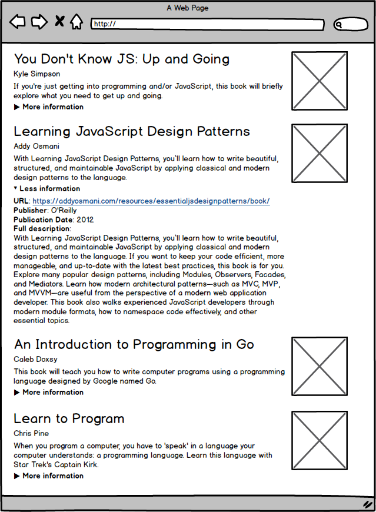

# React Freeshelf

Your project is to build a single-page application that displays books using React. You do not need to run any command to create an application because there already is a React application in this repo.

The finished product will look like the included wireframe. When the information for a book is clicked, the section expands to show additional information about the book. When it is clicked again, it should collapse back to the original view. 

### Getting started with local development

1. Clone this repo and `cd` into it
2. Run `npm install`, just like that with no arguments, to install all the dependencies that are listed in the package.json file.
3. Open the project and start working in the `src` folder. 
4. You can run the application locally by running `npm start` in the terminal. This will automatically open a new browser window for you.

### Accessibility (A11y)

This hiding/showing behavior when something in the UI is clicked is commonly referred to as a disclosure, as described in [this Web Accessibility (A11y) practices document with examples](https://www.w3.org/WAI/ARIA/apg/patterns/disclosure/). The `aria-expanded` attribute should be updated to indicate whether the section is expanded or collapsed. Note that this does not actually control whether something is expanded or not, but is used to indicate whether something is expanded or collapsed. Assistive technologies rely on accessibility attributes like this to provide information to users about the state of the UI.

### Data and UI

The page should display a list of books with a thumbnail display of detail for each book, including:

+ title
+ author
+ short description
+ image of the book's cover

The additional information shown in the expanded view should include:

+ URL
+ publisher
+ publication date
+ expanded description

You will need a list of books to display in your application. A JSON file with book data is included in your `src` directory and is already imported into the `App.js` file for you to use.

Note that you will need to handle cases where not all the data is available. In these cases, make sure your UI design can accommodate missing or problematic data and/or supply placeholder images or text so that your page won't look broken without it. **Do not edit the data.**

## Wireframe

## 🌶️ Spicy Options

- Before displaying the books, sort them so they display in alphabetical order by title
- Add controls to change the sort so the user can choose to sort by title, author, or publication date
- Add a search bar that filters the list of books by title or author
- Add a button to toggle between a grid view and a list view. How will you handle the expanded view in the grid view?
- When the user clicks to expand a book, scroll the page so that the expanded view is at the top of the page

## Rubric for Completion

### Functionality and User Experience
  - Unsatisfactory: does not show all information or does not show/hide information correctly; edits the JSON data
  - Satisfactory: shows all books and shows/hides extra information about a single book when the UI element is clicked
  - Exemplary: meets all requirements, is nicely styled,  handles missing information gracefully, and uses the `aria-expanded` attribute for accessibility

### React Usage
  - Unsatisfactory: uses DOM manipulation or HTML directly to show and hide information
  - Satisfactory: uses JSX, conditional rendering, and state to show and hide information
  - Exemplary: composes the UI using components in an organized way
